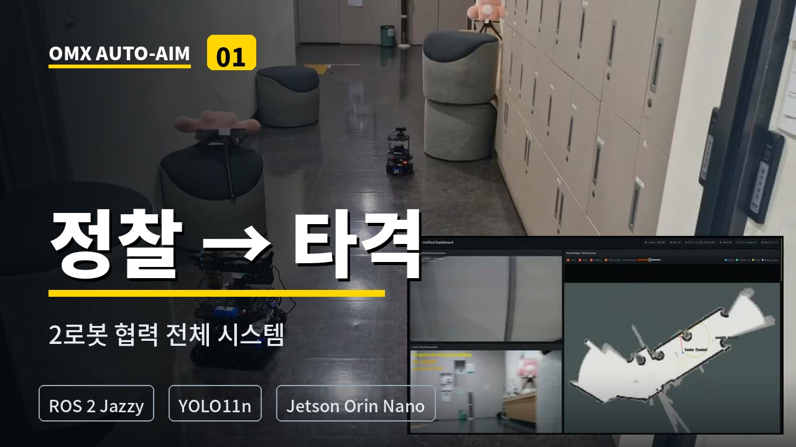
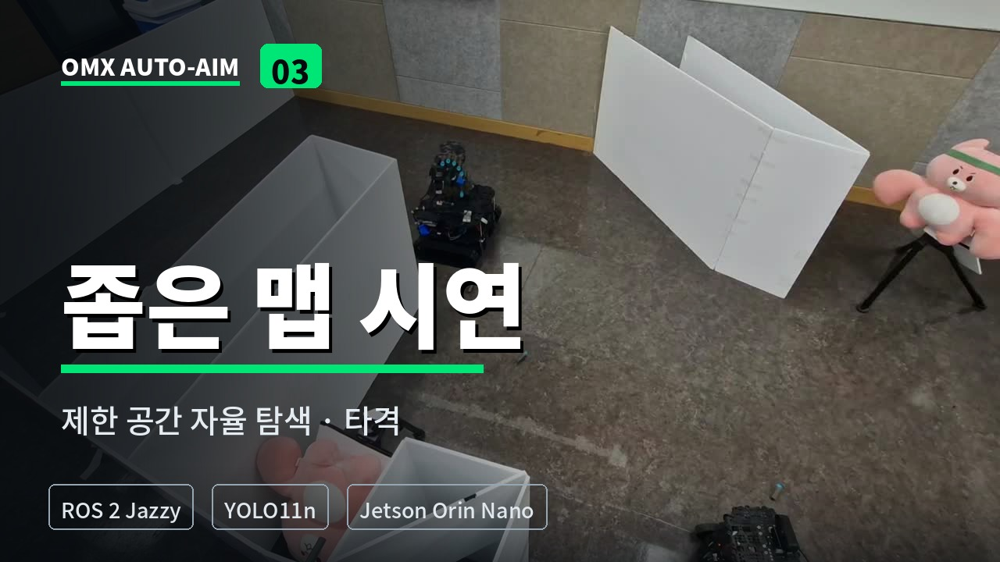
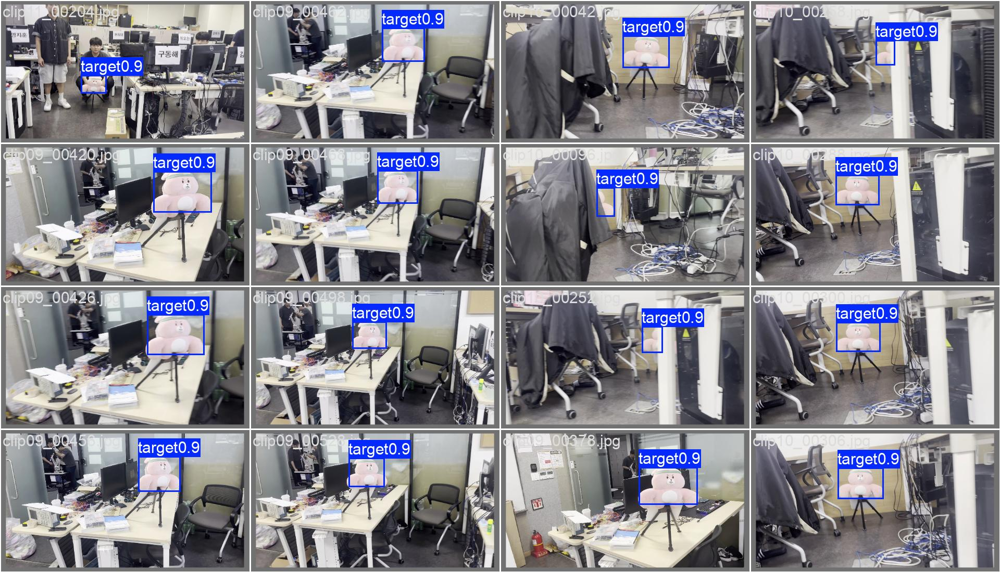

# ROS 2 Multi-Robot Autonomous Exploration & Response System

<div align="center">

**강화학습 기반 자율 탐색, 실시간 위험 지도 생성,  
다중 로봇 임무 인계와 OMX 자동 조준을 통합한 협업 로봇 시스템**

<br>


</div>

---

## Demo

<div align="center">

<!-- docs/media/system_demo.gif 파일을 업로드한 뒤 사용 -->


<br>

[▶ 전체 시스템 데모 영상 보기](https://youtu.be/gJrPbyOyMIo?si=wJMBEp_GhF82pnUG)

</div>

> **Demo flow:**  
> SAC 자율 탐색 → 실시간 SLAM 및 위험 지도 생성 → 위험 좌표 공유 →  
> Leader Waffle 이동 → YOLO 표적 검출 → IBVS 정밀 조준 → 타격

---

## Project Overview

본 프로젝트는 세 대의 TurtleBot3가 역할을 분담하여 **자율 탐색부터 위험 표적 대응까지 수행하는 ROS 2 기반 다중 로봇 시스템**입니다.

Active Scout는 SAC 강화학습 정책을 이용해 환경을 탐색하면서 SLAM 지도와 위험 지도를 생성합니다. Leader Waffle은 공유된 지도와 위험 좌표를 이용해 목표 지점으로 이동하고, OpenManipulator-X가 YOLO 객체 검출과 IBVS 제어를 통해 표적을 자동으로 조준하고 타격합니다.

Active Scout에 장애가 발생하면 대기 중인 Follower Scout가 마지막 정찰 위치로 이동하여 탐색 임무를 이어받도록 설계했습니다.

### Operation Flow

1. Active Scout가 SAC 정책을 이용해 미지 환경을 자율 탐색
2. Cartographer SLAM으로 실시간 지도 생성
3. 카메라 객체 검출 결과를 Bayesian Risk Map에 반영
4. 지도·위험 좌표·로봇 상태를 Leader에게 공유
5. Leader Waffle이 Nav2를 이용해 대응 위치로 이동
6. OpenManipulator-X가 Point-at IK로 표적 방향을 개략 조준
7. Custom YOLO11n과 IBVS 제어로 표적을 정밀 추적
8. 조준 안정성과 안전 조건을 만족하면 타격 동작 수행
9. Active Scout 장애 발생 시 Follower Scout가 탐색 임무 인계

---

## Robot Roles

| Robot | Domain | Role | Main Functions |
|---|---:|---|---|
| **Active Scout** | 22 | 자율 정찰 로봇 | SAC 기반 탐색, Cartographer SLAM, 위험 지도 생성, 카메라 데이터 송신 |
| **Follower Scout** | 21 | 예비 정찰 로봇 | Leader 추종, Active Scout 상태 감시, 장애 발생 시 탐색 임무 인계 |
| **Leader Waffle** | 20 | 대응 및 통합 로봇 | 공유 지도 수신, AMCL/Nav2 주행, 통합 대시보드, OMX 자동 조준 및 타격 |

---

## System Architecture

```text
[Active Scout · Domain 22]
 SAC RL Exploration
 Cartographer SLAM
 Bayesian Risk Map
 Camera Streaming
          │
          │ Map / Risk / Pose / Status
          ▼
[ROS 2 Domain Bridge]
          │
          ▼
[Leader Waffle · Domain 20]
 Unified Dashboard
 Shared Map + AMCL + Nav2
 Target Coordinate Processing
 OMX Auto-Aim
 YOLO11n + IBVS + Firing
          ▲
          │ Failover / Role / Pose
          │
[Follower Scout · Domain 21]
 Leader Following
 Scout Failure Detection
 Mission Takeover
```

각 로봇은 별도의 `ROS_DOMAIN_ID`에서 동작합니다. Domain Bridge를 통해 지도, 위험 정보, 로봇 위치 및 상태처럼 협업에 필요한 데이터만 전달하고, 하드웨어 속도 명령은 각 로봇의 도메인 내부에서 처리하여 `/cmd_vel` 충돌을 방지했습니다.

---

## Key Features

### SAC-Based Autonomous Exploration

- 학습된 SAC 정책을 이용해 TurtleBot3의 선속도와 각속도 생성
- 실물 로봇 환경에서 강화학습 정책 추론 수행
- SLAM 지도와 탐색 우선도 정보를 정책 입력으로 활용

### Real-Time SLAM and Bayesian Risk Map

- Cartographer 기반 실시간 지도 생성
- 객체 검출 결과와 로봇 위치를 지도 좌표계로 변환
- 표적 검출 정보와 위험도를 Risk Map에 누적

### Multi-Robot Failover

- Active Scout의 상태와 heartbeat 감시
- Scout 장애 발생 시 Follower가 마지막 위치로 이동
- 역할 전환 후 SLAM·Risk Map·탐색 임무 인계

### ROS 2 Multi-Domain Architecture

- Leader, Active Scout, Follower를 Domain 20·21·22로 분리
- 필요한 토픽만 Domain Bridge로 전달
- 로봇별 하드웨어 명령 권한을 분리하여 제어 충돌 방지

### Nav2-Based Autonomous Response

- 공유 지도와 위험 좌표를 기반으로 Leader 이동 목표 생성
- AMCL을 이용한 Leader 위치 추정
- Nav2 이동과 OMX 조준 작업을 상태 머신으로 연계

### YOLO and IBVS Auto-Aim

- 프로젝트 전용 Custom YOLO11n 모델로 표적 검출
- Bounding Box 중심과 영상 중심 사이의 오차 계산
- IBVS 기반 Pan/Tilt PD 제어로 OpenManipulator-X 정밀 조준

### Safe Firing State Machine

- `IDLE → WAITING_NAV → AIMING → SCANNING → TRACKING → CONFIRMING → FIRING → COOLDOWN`
- Deadband 내부 유지 시간과 조준 안정성 확인
- Cooldown, 타격 비활성화 및 긴급 중단 조건 적용

### Unified Web Dashboard

- 로봇 카메라와 YOLO 검출 결과 실시간 표시
- 지도, 위험도, 로봇 위치와 Nav2 경로 시각화
- 역할, 연결 상태, 조준 상태 및 시스템 준비 상태 통합 모니터링

---

## Demo Scenarios

### 1. Autonomous Exploration, Mapping and Target Response

<div align="center">

[](https://youtu.be/gJrPbyOyMIo?si=wJMBEp_GhF82pnUG)

</div>

- Active Scout가 SAC 정책으로 환경 탐색
- SLAM 지도와 위험 정보 실시간 갱신
- 위험 좌표를 전달받은 Leader Waffle이 목표 위치로 이동
- OpenManipulator-X가 표적을 조준하고 타격

### 2. IBVS Target Tracking and Firing

<div align="center">

[](https://youtu.be/t03m8PHifMo?si=kqOEwDX6STCyj-Lc)

</div>

- YOLO11n이 분홍색 표적 검출
- 영상 중심 오차를 이용해 Pan/Tilt 관절 제어
- 표적이 Deadband 내부에서 안정적으로 유지되면 타격
- 타격 후 Home 자세로 복귀

### 3. Additional System Demo

<div align="center">

[](https://youtu.be/vuF_W8wdSJ0?si=lV1SKcmuB-jaH3uk)

</div>

<!-- 세 번째 영상의 실제 내용에 맞게 아래 설명을 수정 -->
- 세 번째 데모의 핵심 시나리오
- 검증하려는 시스템 기능
- 영상에서 확인할 수 있는 결과

---

## Custom YOLO11n Target Detector

프로젝트의 분홍색 표적을 실시간으로 검출하기 위해 **데이터 수집, 프레임 추출, 라벨링, 모델 학습, 성능 검증 및 Jetson 배포까지 직접 수행**했습니다.

### Training Pipeline

1. 실제 로봇 운용 환경에서 표적 영상 촬영
2. 영상에서 학습용 이미지 프레임 추출
3. 표적 영역을 `target` 단일 클래스로 직접 라벨링
4. Train / Validation 데이터셋 분리
5. YOLO11n 모델을 100 epochs 학습
6. Validation 결과를 통해 최적 가중치 `best.pt` 선정
7. Jetson Orin Nano의 ROS 2 실시간 검출 노드에 모델 적용
8. 검출 박스 중심 좌표를 IBVS 제어 입력으로 사용

### Model Performance

| Metric | Validation Result |
|---|---:|
| Precision | ≈ 0.99 |
| Recall | ≈ 0.99 |
| mAP@0.5 | ≈ 0.99 |
| mAP@0.5:0.95 | ≈ 0.79 |
| Training Epochs | 100 |
| Model | YOLO11n |
| Classes | 1 (`target`) |

> 위 수치는 프로젝트 실험 환경에서 구성한 validation dataset 기준입니다.

### Training Results

<div align="center">


</div>

학습이 진행됨에 따라 Train/Validation Loss가 감소했고, Precision, Recall 및 mAP@0.5가 안정적으로 수렴했습니다.

### Validation Predictions

<div align="center">



</div>

거리, 표적 크기, 촬영 각도 및 부분 가림 상태가 다른 Validation 이미지에서 분홍색 표적을 검출한 결과입니다.

### Vision-to-Control Pipeline

```text
Camera Frame
    ↓
Custom YOLO11n Detection
    ↓
Bounding Box Center (cx, cy)
    ↓
Image Center Error (ex, ey)
    ↓
IBVS PD Controller
    ↓
OpenManipulator-X Pan / Tilt Control
    ↓
Target Alignment
    ↓
Safety Confirmation and Firing
```

---

## My Contribution

본 프로젝트에서 **Leader Waffle의 자동 조준 및 타격 서브시스템, 프로젝트 전용 YOLO11n 표적 검출 모델 개발, 그리고 전체 다중 로봇 시스템 통합**을 담당했습니다.

### Vision AI and Target Detection

- 프로젝트 전용 분홍색 표적 데이터 직접 촬영 및 데이터셋 구성
- 영상 프레임 추출과 `target` 단일 클래스 Bounding Box 라벨링
- YOLO11n 모델 학습 및 Validation 성능 분석
- 최적 가중치 `best.pt` 선정 및 Jetson Orin Nano 배포
- ROS 2 실시간 YOLO 검출 노드에 학습 모델 적용
- Bounding Box 중심 좌표를 IBVS 제어 입력으로 연동
- 표적 미검출, 재검출 및 신뢰도 조건을 자동 조준 상태 머신과 통합

### OMX Auto-Aim System

- OpenManipulator-X 기반 자동 조준 및 타격 파이프라인 설계
- 지도상의 위험 좌표를 로봇팔 조준 방향으로 변환하는 Point-at IK 적용
- YOLO 검출 결과와 영상 중심 오차를 이용한 IBVS 제어 구현
- 표적 중심 정렬을 위한 Pan/Tilt PD 제어 및 Deadband 튜닝
- `AIMING → SCANNING → TRACKING → CONFIRMING → FIRING` 상태 머신 구현
- 조준 안정성 유지 시간과 Cooldown을 포함한 안전 타격 조건 설계

### ROS 2 Integration

- Scout가 생성한 지도와 위험 좌표를 Leader Waffle 이동 및 조준 시스템과 연동
- Nav2 이동 명령과 OMX 조준 동작을 비동기 상태 머신으로 연결
- 긴급 TARGET 입력 시 진행 중인 순찰 작업을 중단하는 우선순위 큐 및 선점 처리
- 조준 가능한 위치가 아닐 경우 후보 위치를 평가하여 재이동하는 View Pose 로직 적용
- ROS 2 토픽과 노드 간 인터페이스 설계 및 실제 로봇 통합 테스트

### Embedded and Hardware Integration

- Jetson Orin Nano에서 ROS 2, YOLO 및 OpenManipulator-X 구동 환경 구성
- GPIO 기반 타격 장치 제어 및 발사 펄스 출력 구현
- 부팅·종료 시 출력 LOW 유지, 타격 비활성화 및 Cooldown 안전 기능 적용
- 실물 로봇의 모터 방향, 관절 한계, 조준 오차 및 제어 파라미터 조정

### Monitoring and Demonstration

- Flask 기반 YOLO 영상 및 조준 상태 디버그 스트리밍 연동
- 통합 대시보드에서 로봇 상태, 실시간 지도, 경로 및 객체 검출 결과 검증
- 실물 로봇과 대시보드 영상을 동기화하여 탐색·이동·조준·타격 과정 기록

> 전체 다중 로봇 시스템은 팀원들과 공동으로 개발했으며,  
> 본 README에서는 제가 담당한 YOLO 모델 개발, OMX 자동 조준·타격 및 Leader 연동 부분을 중심으로 정리했습니다.

---

## Tech Stack

| Category | Technologies |
|---|---|
| **Robotics** | ROS 2 Jazzy, TurtleBot3 Burger/Waffle, OpenManipulator-X |
| **Navigation** | Nav2, AMCL, Cartographer SLAM |
| **AI / Vision** | YOLO11n, Ultralytics, OpenCV, PyTorch |
| **Reinforcement Learning** | SAC, Stable-Baselines3 |
| **Control** | IBVS, PD Control, Point-at IK, State Machine |
| **Embedded** | Jetson Orin Nano, Raspberry Pi, GPIO |
| **Communication** | ROS_DOMAIN_ID, Domain Bridge, DDS |
| **Dashboard** | Flask, MJPEG, SSE, HTML/CSS/JavaScript |
| **Language / Tools** | Python, Linux, Git, GitHub |

---

## Repository Structure

아래는 프로젝트의 주요 패키지와 역할입니다.

```text
ROS2-Project/
├── README.md
├── docs/
│   └── media/                       # README 이미지, GIF 및 영상 썸네일
├── src/
│   ├── system_bringup/              # 역할 기반 전체 시스템 실행 및 통합 대시보드
│   ├── fleet_bringup/               # 다중 로봇 역할·상태·Failover 관리
│   ├── turtlebot3_rl_training/      # SAC 학습 및 실물 정책 추론
│   ├── bayesian_risk_map/           # 객체 검출 결과 기반 위험 지도 생성
│   ├── flask_yolo_bridge/           # 카메라 전송 및 Jetson YOLO 추론 연동
│   ├── region_mapper/               # 지도 영역과 위험 정보 처리
│   ├── omx_aim/                     # OMX 자동 조준·IBVS·타격 서브시스템
│   └── multi/                       # 다중 로봇 관련 보조 노드
└── ...
```

> 세부 실행 인자와 각 패키지 설명은  
> [`src/system_bringup/README.md`](src/system_bringup/README.md)를 참고하세요.

---

## Build and Run

### 1. Build

```bash
cd ~/ROS2-Project
source /opt/ros/jazzy/setup.bash

colcon build --symlink-install
source install/setup.bash
```

### 2. Active Scout — Domain 22

```bash
cd ~/ROS2-Project
source /opt/ros/jazzy/setup.bash
source install/setup.bash

export ROS_DOMAIN_ID=22
export TURTLEBOT3_MODEL=burger

ros2 launch system_bringup field_robot.launch.py \
  robot_name:=scout22 \
  domain_id:=22 \
  initial_role:=ACTIVE_SCOUT
```

### 3. Follower Scout — Domain 21

```bash
cd ~/ROS2-Project
source /opt/ros/jazzy/setup.bash
source install/setup.bash

export ROS_DOMAIN_ID=21
export TURTLEBOT3_MODEL=burger

ros2 launch system_bringup field_robot.launch.py \
  robot_name:=follower21 \
  domain_id:=21 \
  initial_role:=FOLLOWER
```

### 4. Leader Waffle — Domain 20

```bash
cd ~/ROS2-Project
source /opt/ros/jazzy/setup.bash
source install/setup.bash

export ROS_DOMAIN_ID=20
export TURTLEBOT3_MODEL=waffle

ros2 launch system_bringup field_robot.launch.py \
  initial_role:=LEADER \
  robot_name:=leader \
  domain_id:=20 \
  risk_domain_id:=22
```

### 5. PC Debug Viewer

```bash
ros2 launch system_bringup pc.launch.py
```

> 실제 실행 환경에는 로봇별 네트워크, 카메라 장치, YOLO 모델 경로 및 Domain Bridge 설정이 필요합니다.  
> 자세한 설정은 각 패키지의 README와 config 파일을 참고하세요.

---

## Related Repository

### [OMX Auto-Aim Subsystem](https://github.com/dladyddn133-creator/omx_aim)

`omx_aim` 저장소는 본 프로젝트의 **Leader Waffle 자동 조준 및 타격 서브시스템**을 별도로 정리한 저장소입니다.

다음 내용을 더 자세히 확인할 수 있습니다.

- Point-at IK 기반 개략 조준
- Custom YOLO 객체 검출
- IBVS Pan/Tilt 제어
- 우선순위 큐와 상태 머신
- View Pose 후보 평가
- GPIO 기반 타격 장치
- 실물 로봇 통합 및 제어 파라미터 튜닝

---

## Project Status

- 실물 다중 로봇 통합 및 데모 완료
- YOLO11n 표적 검출 모델 학습 및 Jetson 배포 완료
- OMX 자동 조준·IBVS·타격 파이프라인 구현 완료
- 저장소는 포트폴리오와 기술 문서 목적으로 유지합니다.
